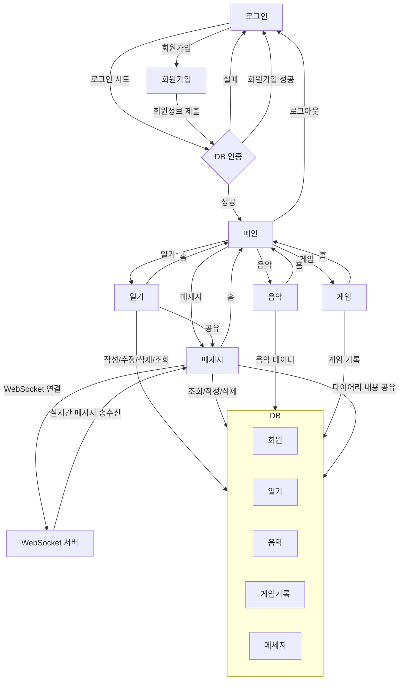

```mermaid
flowchart TD
    login[로그인] -->|회원가입| signup[회원가입]
    login -->|로그인 시도| auth{DB 인증}
    signup -->|회원정보 제출| auth
    auth -- 성공 --> main[메인]
    auth -- 실패 --> login
    auth -- 회원가입 성공 --> login

    main -->|일기| diary[일기]
    main -->|음악| music[음악]
    main -->|게임| game[게임]
    main -->|메세지| message[메세지]
    main -->|로그아웃| login

    diary -->|홈| main
    music -->|홈| main
    game -->|홈| main
    message -->|홈| main

    %% 일기 CRUD (간략화)
    diary -->|작성/수정/삭제/조회| db_tables
    %% 메세지 기능 (간략화)
    message -->|조회/작성/삭제| db_tables
    music -->|음악 데이터| db_tables
    game -->|게임 기록| db_tables

    %% 웹소켓 실시간 메신저
    message -- WebSocket 연결 --> ws[WebSocket 서버]
    ws -- 실시간 메시지 송수신 --> message

    %% 다이어리 공유 기능
    diary -->|공유| message
    message -->|다이어리 내용 공유| db_tables

    subgraph db_tables [DB]
        member[회원]
        diary_tb[일기]
        music_tb[음악]
        game_tb[게임기록]
        msg_tb[메세지]
    end
```
